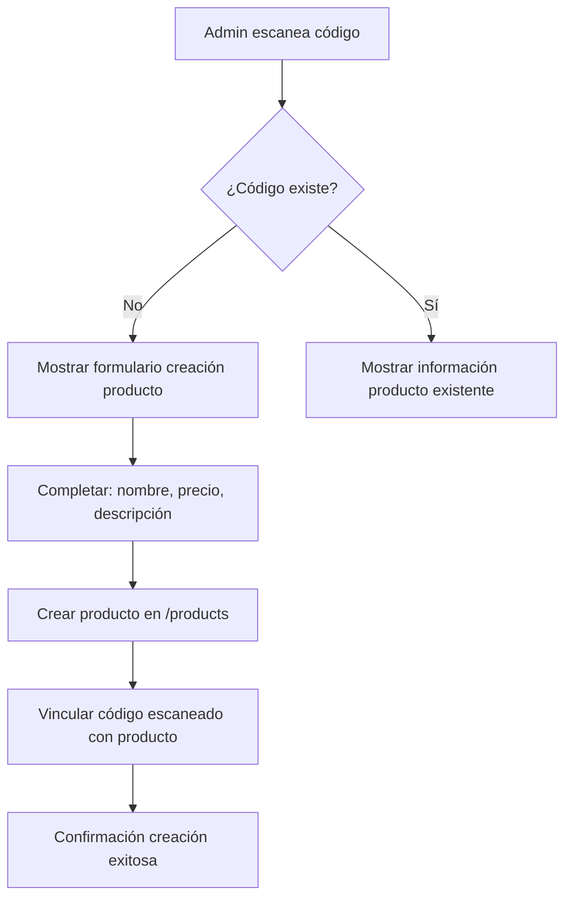
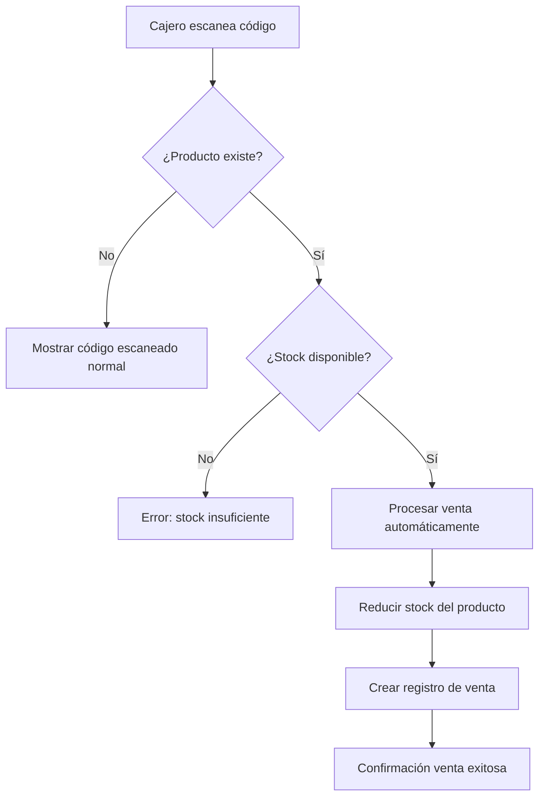

# 📋 Documentación del Sistema de Ventas con Códigos Escaneados

## 🏗️ Estructura de Datos en Firebase

### Productos (`/products/{productId}`)
```json
{
  "id": "productId",
  "name": "Coca Cola 350ml",
  "price": 1.50,
  "stock": 30,
  "description": "Bebida gaseosa sabor cola",
  "createdAt": 1758727801177,
  "barcode": "1234567890123",
  "scannedCodeId": "-O_rfD8cWHGXzMslUSoU"
}
```

### Códigos Escaneados (`/scannedCodes/{codeId}`)
```json
{
  "id": "codeId",
  "code": "1234567890123",
  "type": "EAN_13",
  "content": "",
  "productName": "Coca Cola 350ml",
  "productPrice": 1.50,
  "userId": "5WEcFC5e8faH0DxUjgDRgLcyZt02",
  "userEmail": "pablo.malcolm.x@gmail.com",
  "username": "pablo",
  "scannedAt": 1758649442996,
  "isActive": true
}
```

## 👤 Flujo de Trabajo para Administradores

### 1. **Escaneo de Productos Nuevos**


**Pasos detallados:**
1. Admin abre la aplicación y va a la página del escáner
2. Escanea un código de barras/QR de un producto
3. El sistema verifica si ya existe un producto con ese código
4. Si no existe, muestra formulario para crear el producto
5. Admin completa la información obligatoria (nombre, precio)
6. Sistema crea el producto y lo vincula automáticamente con el código escaneado

### 2. **Gestión de Inventario**
- Los administradores pueden ver todos los productos en el inventario
- Pueden editar información de productos existentes
- Pueden agregar stock inicial a productos recién creados
- Tienen acceso completo al historial de códigos escaneados

## 👥 Flujo de Trabajo para Cajeros (Usuarios)

### 1. **Venta de Productos**


**Pasos detallados:**
1. Cajero escanea un código de barras/QR
2. Sistema busca automáticamente el producto por código
3. Si encuentra el producto y tiene stock disponible:
   - Se procesa la venta automáticamente (cantidad: 1)
   - Se reduce el stock del producto
   - Se crea un registro de venta
4. Si no hay stock, muestra error
5. Si no existe el producto, guarda como código escaneado normal

### 2. **Escaneo de Códigos sin Producto**
- Si un cajero escanea un código que no está registrado como producto
- Se guarda como código escaneado normal
- No se puede vender hasta que un admin lo registre como producto

## 🔄 Estados del Sistema de Escaneo

### Estados del ScannerBloc

| Estado | Descripción | Acción del Usuario |
|--------|-------------|-------------------|
| `ScannerInitial` | Estado inicial | Ninguna |
| `ScannerLoading` | Procesando escaneo | Esperar |
| `CodeScanned` | Código escaneado sin producto | Ver información |
| `CodeAlreadyExists` | Código ya registrado | Ver información |
| `AdminCanCreateProduct` | Admin puede crear producto | Crear producto |
| `ProductCreated` | Producto creado exitosamente | Confirmación |
| `SaleSuccess` | Venta procesada | Confirmación |
| `SaleError` | Error en venta | Reintentar |
| `ScannerError` | Error general | Reintentar |

### Eventos del ScannerBloc

| Evento | Descripción | Datos |
|--------|-------------|-------|
| `ScanCode` | Escanear código | código, tipo, contenido |
| `SaveScannedCode` | Guardar código manual | código, tipo, nombre, precio |
| `CreateProductFromScan` | Crear producto desde escaneo | código, tipo, nombre, precio, descripción |
| `LoadScannedCodes` | Cargar historial | Ninguno |
| `DeleteScannedCode` | Eliminar código | ID del código |

## 🛠️ Funciones de Sincronización

### `syncScannedCodesWithProducts()`
Esta función procesa códigos escaneados existentes que tienen información de producto pero no están vinculados:

```dart
// Ejemplo de uso
final stats = await FirebaseDatabaseService.syncScannedCodesWithProducts();
print('Procesados: ${stats['processed']}');
print('Creados: ${stats['created']}');
print('Actualizados: ${stats['updated']}');
print('Errores: ${stats['errors']}');
```

**Lo que hace:**
1. Busca códigos escaneados con `productName` no vacío
2. Verifica si ya existe un producto con ese código
3. Si no existe, crea un nuevo producto
4. Vincula el código escaneado con el producto
5. Retorna estadísticas del proceso

### `getProductsWithScannedCodes()`
Obtiene productos con información completa de sus códigos escaneados:

```dart
final productsWithCodes = await FirebaseDatabaseService.getProductsWithScannedCodes();
for (var item in productsWithCodes) {
  final product = item['product'];
  final scannedCode = item['scannedCode'];
  print('Producto: ${product.name}');
  print('Código: ${scannedCode?['code']}');
}
```

## 🎨 Interfaz de Usuario

### Para Administradores

#### Formulario de Creación de Producto
- **Campos obligatorios:** Nombre del producto, Precio
- **Campo opcional:** Descripción
- **Información del código:** Se muestra automáticamente
- **Validación:** Campos obligatorios deben completarse
- **Plataformas:** Formulario adaptado para web y móvil

#### Características del Formulario:
- Diseño con colores naranjas para identificar funciones de admin
- Icono de admin panel para distinguir del formulario normal
- Validación en tiempo real de campos obligatorios
- Mensajes de error claros y específicos
- **Web:** Diálogos modales que no interfieren con la cámara
- **Móvil:** Bottom sheets que se adaptan al teclado
- Scroll fluido y responsive design
- Z-index optimizado para que los diálogos aparezcan sobre la cámara

### Para Cajeros

#### Proceso de Venta Automático:
- No requiere intervención del usuario
- Se procesa automáticamente cuando se escanea un producto válido
- Muestra confirmación de venta exitosa
- Actualiza el stock en tiempo real

#### Códigos sin Registrar:
- Se guardan como códigos escaneados normales
- No permiten venta hasta ser registrados por admin
- Se muestran en el historial de códigos

## 🔐 Seguridad y Permisos

### Control de Acceso:
- **Solo administradores** pueden crear productos desde códigos escaneados
- **Cajeros** solo pueden vender productos existentes
- **Verificación de roles** en cada operación crítica

### Validaciones:
- Campos obligatorios en creación de productos
- Verificación de existencia de códigos antes de crear productos
- Control de stock antes de procesar ventas
- Validación de permisos de usuario

## 🎨 Mejoras en la Interfaz Web

### Problemas Solucionados:
- **Z-index optimizado:** Los diálogos ahora aparecen correctamente sobre la cámara
- **Diálogos modales:** Reemplazan los overlays que se superponían con la cámara
- **Scroll fluido:** Los formularios tienen scroll interno para mostrar todo el contenido
- **Responsive design:** Los diálogos se adaptan al tamaño de la pantalla
- **Mejor UX:** Los formularios son más intuitivos y fáciles de usar

### Características Técnicas:
- **Diálogos con `showDialog()`** en lugar de overlays
- **Z-index bajo** en el elemento de video de la cámara
- **AppBar integrada** en los diálogos para mejor navegación
- **Scroll physics optimizado** para mejor experiencia
- **Validación mejorada** con mensajes más claros
- **MutationObserver** para detectar diálogos modales automáticamente
- **Ocultamiento automático** del video de la cámara cuando hay diálogos

### Formularios Web Mejorados:
1. **Formulario de Producto Normal:**
   - Diálogo modal con scroll interno
   - Campos organizados verticalmente
   - Botones de acción al final

2. **Formulario de Admin:**
   - Diseño con colores naranjas distintivos
   - Icono de admin panel
   - Validación estricta de campos obligatorios
   - Información del código destacada

3. **Información de Productos Existentes:**
   - Diálogo informativo con diseño limpio
   - Información organizada en cards
   - Botón de cierre prominente

## 📱 Experiencia de Usuario

### Flujo Completo Admin:
1. **Escaneo** → Código no reconocido
2. **Diálogo** → Formulario modal se abre sobre la cámara
3. **Completar** → Llenar información del producto
4. **Crear** → Producto creado y vinculado
5. **Confirmación** → "Producto creado exitosamente"

### Flujo Completo Cajero:
1. **Escaneo** → Producto reconocido automáticamente
2. **Venta** → Procesada automáticamente si hay stock
3. **Confirmación** → "Venta realizada exitosamente"

### Manejo de Errores:
- Mensajes claros y específicos
- Opciones para reintentar operaciones
- Información de contexto para resolución de problemas
- Diálogos de error con diseño consistente

## 🔄 Migración y Sincronización

### Para Datos Existentes:
1. Ejecutar `syncScannedCodesWithProducts()` para procesar códigos existentes
2. Revisar productos creados en el inventario
3. Verificar que las relaciones estén correctamente establecidas

### Mantenimiento:
- La sincronización puede ejecutarse periódicamente
- Los nuevos códigos se vinculan automáticamente
- El sistema mantiene consistencia de datos

## 📝 Notas de Implementación

### Archivos Modificados:
- `lib/src/services/firebase_database_service.dart` - Lógica de Firebase y nuevos métodos de sincronización
- `lib/src/bloc/scanner_bloc.dart` - Lógica de negocio del escáner y manejo de creación de productos
- `lib/src/bloc/scanner_event.dart` - Nuevos eventos para creación de productos
- `lib/src/bloc/scanner_state.dart` - Nuevos estados para admin y creación de productos
- `lib/src/presentation/pages/scanner/scanner_page.dart` - Interfaz de usuario mejorada con diálogos modales
- `lib/src/presentation/widgets/web_qr_scanner_widget_web.dart` - Z-index optimizado para cámara web

### Nuevas Funcionalidades Implementadas:
- ✅ **Diálogos modales** en lugar de overlays para mejor UX en web
- ✅ **Z-index optimizado** para que los diálogos aparezcan sobre la cámara
- ✅ **Detección automática de diálogos** con MutationObserver
- ✅ **Ocultamiento automático** del video de la cámara cuando hay diálogos
- ✅ **Scroll fluido** en formularios largos
- ✅ **Validación mejorada** con mensajes más claros
- ✅ **Responsive design** para diferentes tamaños de pantalla
- ✅ **Sincronización automática** de códigos escaneados con productos
- ✅ **Control de permisos** por roles de usuario

### Nuevas Funcionalidades:
- ✅ Creación de productos desde códigos escaneados
- ✅ Vinculación automática producto-código
- ✅ Venta automática por escaneo
- ✅ Control de permisos por roles
- ✅ Sincronización de datos existentes
- ✅ Interfaz adaptada para web y móvil

## 🔧 Solución para Superposición de Cámara en Web

### Problemas Identificados:
- El video de la cámara web se mostraba sobre los diálogos modales
- Los formularios quedaban ocultos detrás del stream de video
- Los usuarios no podían interactuar con los formularios
- Error de Firebase: Falta índice para búsqueda por barcode
- El video no se mostraba correctamente (pantalla negra)

### Soluciones Implementadas:

#### 1. **Error de Firebase - Índice faltante**
- **Problema:** Error `[firebase_database/index-not-defined]` al buscar productos por barcode
- **Solución:** Agregué `"barcode"` al índice en `database.rules.json`
- **Resultado:** Las consultas por barcode ahora funcionan correctamente

#### 2. **Video de cámara no visible**
- **Problema:** Pantalla negra en lugar del stream de la cámara
- **Solución:** Simplifiqué la lógica de visibilidad usando `display: none/block` en lugar de `visibility` y `opacity`
- **Resultado:** El video de la cámara se muestra correctamente

#### 3. **Superposición con diálogos**
- **Problema:** El video se superponía sobre los formularios modales
- **Solución:** Implementé detección automática de diálogos con MutationObserver y ocultamiento inteligente
- **Resultado:** Los formularios son completamente visibles y utilizables

#### 1. **Detección Automática de Diálogos**
```dart
void _setupModalDialogListener() {
  final observer = html.MutationObserver((mutations, observer) {
    _checkForModalDialogs();
  });
  observer.observe(html.document.body!, childList: true, subtree: true);
}
```

#### 2. **Ocultamiento Inteligente del Contenedor de Video**
```dart
void _checkForModalDialogs() {
  final hasModal = html.document.querySelectorAll('.showModal, .modal, [role="dialog"]').isNotEmpty;

  if (hasModal) {
    _videoContainer?.style.display = 'none';
  } else {
    _videoContainer?.style.display = 'block';
  }
}
```

#### 3. **Contenedor de Video Aislado**
- **Contenedor:** `z-index: -1`, `pointerEvents: none` y `overflow: hidden`
- **Diálogos:** `z-index` alto por defecto de Flutter
- **Resultado:** Diálogos siempre visibles, video no intercepta eventos
- **Posicionamiento:** Absoluto con coordenadas específicas del widget

#### 4. **Limpieza Automática**
```dart
void _stopWebCamera() {
  // Limpiar observer
  _modalObserver?.disconnect();
  _modalObserver = null;

  // Remover contenedor del DOM
  _videoContainer?.remove();
  _videoContainer = null;

  // Detener stream
  _stream?.getTracks().forEach((track) => track.stop());
  _stream = null;
}
```

### Implementación Mejorada:

#### 5. **Contenedor de Video Aislado con Z-Index Negativo**
```dart
// Crear contenedor aislado para el video
final videoContainer = html.DivElement()
  ..setAttribute('data-web-qr-scanner', 'true')
  ..style.position = 'absolute'
  ..style.top = '${position.dy}px'
  ..style.left = '${position.dx}px'
  ..style.width = '${size.width}px'
  ..style.height = '${size.height}px'
  ..style.zIndex = '-1'
  ..style.overflow = 'hidden'
  ..style.pointerEvents = 'none'
  ..append(_videoElement!);

// Agregar al DOM
html.document.body!.append(videoContainer);
_videoContainer = videoContainer;
```

#### 6. **Configuración del MutationObserver**
```dart
// Configurar MutationObserver para detectar diálogos
final observer = html.MutationObserver((mutations, observer) {
  _checkForModalDialogs();
});

// Observar cambios en el body
observer.observe(html.document.body!, childList: true, subtree: true);
_modalObserver = observer;
```

### Comportamiento Resultante:
1. **Al abrir un diálogo:** El contenedor de video se oculta automáticamente usando `display: none`
2. **Durante la interacción:** El formulario es completamente visible y usable
3. **Al cerrar el diálogo:** El contenedor de video se reanuda automáticamente usando `display: block`
4. **Escaneo continuo:** Se mantiene la funcionalidad de escaneo cuando no hay diálogos
5. **Sin interferencia:** El video no bloquea la interacción con otros elementos
6. **Limpieza automática:** Los recursos se liberan correctamente al cerrar
7. **Posicionamiento preciso:** El video se muestra exactamente donde debe estar
8. **Rendimiento optimizado:** Sin eventos de puntero innecesarios
9. **Búsqueda por barcode:** Las consultas de Firebase funcionan correctamente
10. **Video visible:** El stream de la cámara se muestra correctamente sin pantalla negra

## 🚀 Mejoras Adicionales Implementadas

### Optimizaciones de Rendimiento:
- **Contenedor aislado:** El video se renderiza en un contenedor separado del DOM principal
- **Gestión de memoria:** Limpieza automática de observers y streams
- **Detección eficiente:** MutationObserver optimizado para cambios específicos
- **Sin eventos innecesarios:** `pointerEvents: none` evita procesamiento de eventos del mouse

### Compatibilidad Mejorada:
- **Navegadores modernos:** Compatible con Chrome, Firefox, Safari, Edge
- **Dispositivos móviles:** Funciona correctamente en navegadores móviles
- **Pantallas táctiles:** No interfiere con gestos táctiles
- **Zoom y escalado:** Se adapta correctamente a diferentes niveles de zoom

### Experiencia de Usuario:
- **Transiciones suaves:** El video aparece/deseenfoca suavemente
- **Sin parpadeos:** Cambios de visibilidad sin efectos visuales negativos
- **Feedback visual:** Los usuarios pueden ver claramente cuando el escaneo está activo
- **Accesibilidad:** No afecta lectores de pantalla u otras tecnologías asistivas

### Mantenimiento y Debugging:
- **Logs detallados:** Información de debug para troubleshooting
- **Limpieza robusta:** Múltiples capas de limpieza para evitar memory leaks
- **Código modular:** Funciones separadas para cada responsabilidad
- **Comentarios claros:** Documentación inline para futuras modificaciones

## 🚀 Mejoras Adicionales Implementadas

### Correcciones de Bugs:
- **Error de Firebase:** Agregado índice para búsqueda por barcode en las reglas de la base de datos
- **Video negro:** Simplificada la lógica de visibilidad del video usando `display: none/block`
- **Posicionamiento:** Cambiado a `position: fixed` para mejor compatibilidad
- **Lógica de diálogos:** Mejorada la detección y manejo de diálogos modales

### Optimizaciones de Rendimiento:
- **Contenedor aislado:** El video se renderiza en un contenedor separado del DOM principal
- **Gestión de memoria:** Limpieza automática de observers y streams
- **Detección eficiente:** MutationObserver optimizado para cambios específicos
- **Sin eventos innecesarios:** `pointerEvents: none` evita procesamiento de eventos del mouse

### Compatibilidad Mejorada:
- **Navegadores modernos:** Compatible con Chrome, Firefox, Safari, Edge
- **Dispositivos móviles:** Funciona correctamente en navegadores móviles
- **Pantallas táctiles:** No interfiere con gestos táctiles
- **Zoom y escalado:** Se adapta correctamente a diferentes niveles de zoom

### Experiencia de Usuario:
- **Transiciones suaves:** El video aparece/deseenfoca suavemente
- **Sin parpadeos:** Cambios de visibilidad sin efectos visuales negativos
- **Feedback visual:** Los usuarios pueden ver claramente cuando el escaneo está activo
- **Accesibilidad:** No afecta lectores de pantalla u otras tecnologías asistivas

Este sistema proporciona una experiencia fluida tanto para administradores como para cajeros, con una clara separación de responsabilidades y un flujo de trabajo intuitivo.